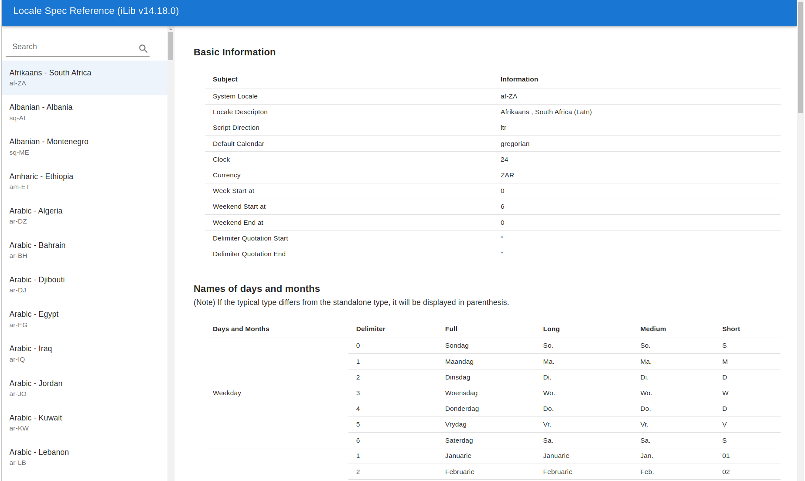

## Overview
This is documentation for checking in locale's information from [iLib](https://github.com/iLib-js/iLib).  
Here's a feature list that you can see:
 * Basic Information
 * Names of days and months
 * Range of Meridiem Units
 * Data Format : Date/Time
 * Data Format : DateRange
 * Data Format : Date/Time Duration
 * Data Format : Number

and Please visit [here](Locales.md) to see the locale list.

#### Preview 


## Getting Started

This project is a simple app that was bootstrapped with [Create React App](https://github.com/facebook/create-react-app) and using [MUI](https://mui.com) to display locale Spec references with [iLib](https://github.com/iLib-js/iLib).  

## Notes

1. This project is already ejected(`eject` in CRA), so you need to maintain all of the configurations yourself.

2. If you want to change the version of ILib or the root of this project, you can change them(`homepage`, `dependencies` in `package.json`, and `basename` in `src/index.js`).

   For example,

```json
// package.json
...
"ilib": "npm:ilib-webos@14.18.0-webos1",
...
"homepage": "http://i18n.lge.com/ilib/localeSpecDoc/reference",
...
```
```js
// src/index.js
...
<BrowserRouter basename="/ilib/localeSpecDoc/reference">
...

```
3. There is a script file to help the above #2 work easily.   
First, Modify  `util/config.json` file. Then execute a `npm run updatePath` in the root. You will find the data is updated properly as you expect.
Here is an example of a  `config.json` file.
```json
// config.json
{
    "packages": {
        "homepage": "http://i18n.lge.com/ilib/localeSpecDoc/reference",
        "ilibVersion": "npm:ilib-webos@14.18.0-webos1"
    },
    "index": {
        "basename":"/ilib/localeSpecDoc/reference"
    }
}
```


## Available Scripts

In the project directory, you can run:

### `npm start`

Runs the app in the development mode.\
Open [http://localhost:3000](http://localhost:3000) to view it in your browser.

The page will reload when you make changes.\
You may also see any lint errors in the console.

### `npm run build`

Builds the app for production to the `build` folder.\
It correctly bundles React in production mode and optimizes the build for the best performance.

The build is minified and the filenames include the hashes.\
Your app is ready to be deployed!

See the section about [deployment](https://facebook.github.io/create-react-app/docs/deployment) for more information.