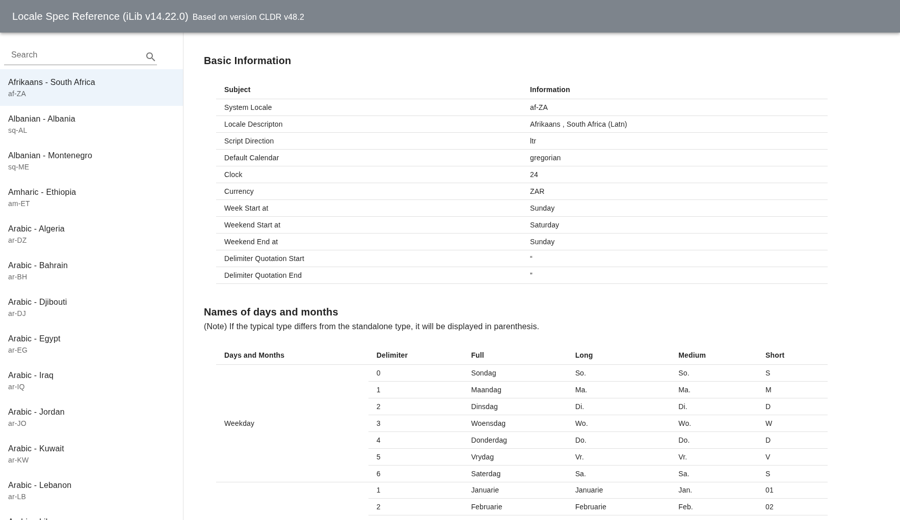

## Overview
This is documentation for checking in locale's information from [iLib](https://github.com/iLib-js/iLib).  
Here's a feature list that you can see:
 * Basic Information
 * Names of days and months
 * Range of Meridiem Units
 * Data Format : Date/Time
 * Data Format : DateRange
 * Data Format : Date/Time Duration
 * Data Format : Number

and Please visit [here](Locales.md) to see the locale list.  

See the [release notes](./ReleaseNotes.md) for details on what is new and what has changed.

#### Preview 


Run `npm run updatePreview` while the local dev server is running.
- Recommended order:
    1. Start dev server in terminal A: `npm start`
    2. Capture preview in terminal B: `npm run updatePreview`
- The script creates a versioned screenshot from `packages.ilibVersion` in `util/config.json` (for example: `localeSpecDoc_Snapshot_v14_22_0-webos1.png`).
- It also updates the Preview image path in this `README.md`.
- By default, it auto-detects `basename` from `src/index.js` and captures `http://localhost:3000{basename}`.

## Getting Started

This project is a simple app that was bootstrapped with [Create React App](https://github.com/facebook/create-react-app) and using [MUI](https://mui.com) to display locale Spec references with [iLib](https://github.com/iLib-js/iLib).  

## Notes

1. This project is already ejected(`eject` in CRA), so you need to maintain all of the configurations yourself.

2. If you want to change the version of ILib or the root of this project, you can change them(`homepage`, `dependencies` in `package.json`, and `basename` in `src/index.js`).

   For example,

```json
// package.json
...
"ilib": "npm:ilib-webos@14.22.0-webos1",
...
"homepage": "http://i18n.lge.com/ilib/localeSpecDoc/reference",
...
```
```js
// src/index.js
...
<BrowserRouter basename="/ilib/localeSpecDoc/reference">
...

```
3. There is a script file to help the above #2 work easily.   
First, Modify  `util/config.json` file. Then execute a `npm run updatePath` in the root. You will find the data is updated properly as you expect.
Here is an example of a  `config.json` file.
```json
// config.json
{
    "packages": {
        "homepage": "http://i18n.lge.com/ilib/localeSpecDoc/reference",
        "ilibVersion": "npm:ilib-webos@14.22.0-webos1"
    },
    "index": {
        "basename":"/ilib/localeSpecDoc/reference"
    }
}
```

4. `npm run updatePath` runs `modifyPath` and `copy` in sequence.
It generates `tmp/package.json` and `tmp/index.js`, then copies them into `package.json` and `src/index.js`.
If you changed `ilibVersion`, run `npm install` again after `npm run updatePath` so the updated dependency is installed.

5. If you need to update sample years used by Date/DateRange/Copyright pages, modify `src/constants/dateConstants.js`.
This does not apply to `src/pages/DaysAndMonths.js`, which intentionally keeps its own sample year anchors to preserve weekday ordering.


## Available Scripts

In the project directory, you can run:

### `npm start`

Runs the app in the development mode.\
Open [http://localhost:3000](http://localhost:3000) to view it in your browser.

The page will reload when you make changes.\
You may also see any lint errors in the console.

### `npm run build`

Builds the app for production to the `build` folder.\
It correctly bundles React in production mode and optimizes the build for the best performance.

After the build step, `postbuild` runs `react-snap` to generate static HTML snapshots.
On Linux, WSL, or server environments, you may need to set the Chrome executable path explicitly:

```bash
export PUPPETEER_EXECUTABLE_PATH=/usr/bin/google-chrome
npm run build
```

The build is minified and the filenames include the hashes.\
Your app is ready to be deployed!

See the section about [deployment](https://facebook.github.io/create-react-app/docs/deployment) for more information.